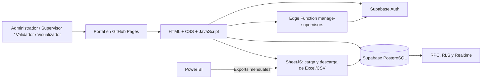

# Portal de Validación y Control de Calidad

Portal web de dichter & neira para distribuir auditorías, validar alertas Smart y Bloqueantes, y analizar los exports operativos mensuales.

La documentación detallada está en [`docs/`](docs/README.md).

## Tecnologías y lenguajes

| Capa | Tecnología | Lenguaje |
| --- | --- | --- |
| Interfaz | Página web estática, sin framework | HTML5, CSS3 y JavaScript moderno (ES modules) |
| Lectura y descarga de archivos | SheetJS, jsPDF y html2pdf cargados desde CDN | JavaScript |
| Servicio de datos y autenticación | Supabase Database, Auth, Realtime y RPC | PostgreSQL y PL/pgSQL |
| Operación administrativa privilegiada | Supabase Edge Function `manage-supervisors` | TypeScript sobre Deno |
| Publicación | GitHub Pages | Sitio estático |

No existe un servidor Node, Java, Python o PHP propio. El navegador se comunica directamente con Supabase mediante `supabase-js`; las reglas RLS y las funciones de PostgreSQL son las que controlan el acceso y las operaciones de datos.

## Arquitectura resumida



## Qué hace el portal

- Gestiona cuentas, estudios y módulos desde Administración.
- Permite que un supervisor cargue Excel o CSV y distribuya auditorías entre validadores.
- Permite que cada validador decida si una alerta **aplica** o **no aplica**, con una tipología obligatoria según la decisión.
- Conserva avance, tiempos, responsable, fechas de validación e histórico de auditorías.
- Presenta indicadores operativos, comerciales y de calidad.
- Carga y cruza tres exports mensuales: **Export general**, **Ediciones** y **Cambio de nota**.
- Permite descargar resultados consolidados y productividad diaria en Excel.

## Estructura del repositorio

```text
.
├── index.html                         # Estructura de todas las vistas y carga de dependencias
├── css/
│   └── styles.css                     # Diseño responsive, tarjetas, tablas y modales
├── js/
│   ├── app.js                         # Controlador principal, vistas, filtros e indicadores
│   ├── supabase-backend.js            # Acceso a Auth, tablas, RPC, Realtime e imports externos
│   ├── supabase-config.js             # URL y clave publicable de Supabase
│   ├── excel-parser.js                # Lectura CSV/XLSX y exportación de libros Excel
│   ├── distributor.js                 # Repartición balanceada de auditorías y KPIs
│   ├── validator-ui.js                # Experiencia de trabajo del validador
│   ├── time-utils.js                  # Formato de hora oficial America/Managua
│   └── sample-data.js                 # Datos de demostración y tipologías iniciales
├── supabase/
│   ├── migrations/                    # Esquema, RLS, índices y funciones PostgreSQL
│   └── functions/manage-supervisors/  # Función Edge en TypeScript/Deno
├── docs/                              # Documentación técnica y operativa
└── SUPABASE_SETUP.md                  # Puesta en marcha inicial de Supabase
```

## Inicio local

No se requiere instalar dependencias ni compilar el proyecto. Desde la raíz, inicie un servidor HTTP estático:

```powershell
python -m http.server 8080
```

Abra `http://localhost:8080`. Las importaciones y validaciones usarán la configuración de Supabase definida en `js/supabase-config.js`; por ello, para pruebas de carga se recomienda un proyecto Supabase de pruebas, no la base productiva.

## Configuración segura

1. Aplique las migraciones de `supabase/migrations` en orden cronológico.
2. Configure la URL y la **publishable key** en `js/supabase-config.js`.
3. Despliegue la Edge Function `manage-supervisors` y configure allí `SUPABASE_URL` y `SUPABASE_SERVICE_ROLE_KEY`.
4. Cree la cuenta administradora y asígnele el rol `admin`, como se describe en [`SUPABASE_SETUP.md`](SUPABASE_SETUP.md).

La clave publicada en el frontend puede estar expuesta porque Supabase RLS limita lo que cada sesión puede leer o modificar. Nunca agregue una `service_role` ni otra clave secreta a `index.html`, `js/` o GitHub Pages.

## Publicación

El portal se publica como sitio estático en GitHub Pages desde el repositorio. Los cambios de interfaz, JavaScript y CSS se despliegan al enviar una revisión a la rama configurada para Pages. Tras un cambio de archivos con caché del navegador, se incrementan los parámetros de versión de los recursos en `index.html` para que los usuarios reciban la versión nueva.

## Documentación disponible

- [`docs/ARCHITECTURE.md`](docs/ARCHITECTURE.md): arquitectura, seguridad, permisos y desempeño.
- [`docs/DATA_DICTIONARY.md`](docs/DATA_DICTIONARY.md): tablas, cruces y columnas de los tres exports.
- [`docs/OPERATIONS_GUIDE.md`](docs/OPERATIONS_GUIDE.md): guía para administrador, supervisor, validador y visualizador.
- [`docs/DEPLOYMENT_AND_MAINTENANCE.md`](docs/DEPLOYMENT_AND_MAINTENANCE.md): despliegue, cambios de esquema, diagnóstico y respaldo.

