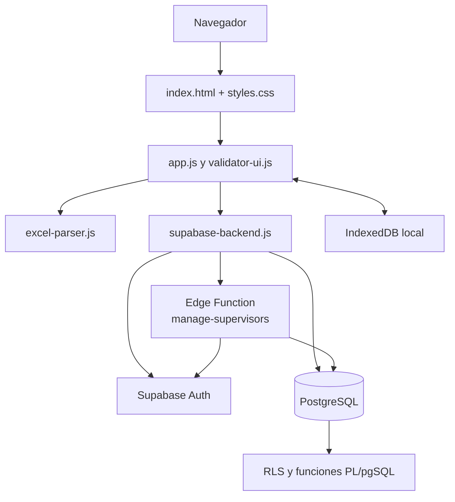

# Arquitectura técnica

## 1. Visión general

El portal es una aplicación de una sola página (SPA ligera) servida como archivos estáticos. `index.html` contiene las secciones y controles de cada vista; `js/app.js` conserva el estado, conecta eventos, calcula indicadores y representa tablas o tarjetas. No usa React, Angular, Vue ni un proceso de compilación.

## 2. Frontend

### Lenguajes y librerías

- **HTML5:** estructura semántica, formularios, modales, navegación y tablas en `index.html`.
- **CSS3:** diseño visual y responsive en `css/styles.css`.
- **JavaScript ES modules:** estado de la aplicación y lógica de negocio en `js/`.
- **SheetJS (`xlsx`):** importa archivos `.xlsx`, `.xls` y `.csv`; genera descargas Excel.
- **jsPDF y html2pdf:** generan reportes PDF desde el navegador cuando la vista lo requiere.
- **supabase-js:** cliente de Auth, Database, RPC, Realtime y Edge Functions.

### Módulos principales

| Archivo | Responsabilidad |
| --- | --- |
| `js/app.js` | Orquesta vistas, roles, carga de datos, cruces, filtros, tarjetas, exports y caché local. |
| `js/supabase-backend.js` | Aísla todas las llamadas a Supabase y transforma filas entre el formato del portal y el formato de base de datos. |
| `js/excel-parser.js` | Detecta CSV/Excel, maneja UTF-8 y Windows-1252, reconoce filas por auditoría o KPI y crea archivos `.xlsx`. |
| `js/distributor.js` | Distribuye con balance simultáneo de cantidad de auditorías y KPIs por revisar. |
| `js/validator-ui.js` | Inicio con código, lista personal de auditorías, guardado y exportación de productividad del validador. |
| `js/time-utils.js` | Muestra fechas y horas con la zona oficial `America/Managua`. |
| `js/sample-data.js` | Contiene muestras de demostración y las opciones de tipología por decisión. |

## 3. Backend de Supabase

El backend se reparte entre servicios administrados por Supabase:

| Componente | Tecnología | Uso en el portal |
| --- | --- | --- |
| Base de datos | PostgreSQL | Auditorías, lotes, asignaciones, resultados de validación y registros normalizados de exports. |
| Funciones y políticas | PL/pgSQL + RLS | Verifican el rol, el estudio/módulo asignado y limitan las operaciones de cada sesión. |
| Autenticación | Supabase Auth | Sesiones de personal y sesión anónima vinculada al código de cada validador. |
| Realtime | Cambios PostgreSQL | Actualiza el avance compartido sin recargar la página. |
| Edge Function | TypeScript/Deno | Crea usuarios, restablece contraseñas, reasigna permisos y elimina cuentas mediante una clave de servidor que no sale al navegador. |

### Función Edge `manage-supervisors`

Está escrita en TypeScript y se ejecuta con Deno. Atiende solicitudes `POST` autenticadas de un administrador para:

- crear usuarios operativos, de visualización o comerciales;
- reasignar estudios y uno o ambos módulos (`smart`, `blocking`);
- cambiar contraseñas;
- eliminar un usuario.

La función valida el JWT, verifica que el solicitante sea administrador activo y usa `SUPABASE_SERVICE_ROLE_KEY` únicamente dentro del entorno de Supabase.

## 4. Roles y acceso

| Rol | Capacidades principales |
| --- | --- |
| `admin` | Gestiona usuarios, estudios, asignaciones y ve todos los módulos y visualizaciones. |
| `supervisor` | Trabaja únicamente en sus estudios y módulos asignados; carga, distribuye y consulta la operación. También puede usar los análisis de exports. |
| `validator` | Accede con código único y solo puede trabajar en auditorías activas que le fueron asignadas. |
| `visualizer` | Consulta el panel operativo y sus análisis, sin administrar cuentas. |
| `commercial` | Consulta la visual comercial o de comité, sin acceso a los datos operativos de exports. |

Los roles no son una condición visual únicamente: RLS en PostgreSQL los valida en cada consulta o actualización.

## 5. Ciclos de datos

### 5.1 Validación operativa

1. Un supervisor carga un Excel/CSV de auditorías.
2. El parser identifica el formato y normaliza auditorías y KPIs.
3. El portal crea un `upload_batch`, persiste las filas en `audits` y activa el lote.
4. `Distributor` reparte las auditorías disponibles entre los validadores activos.
5. El validador registra la decisión de cada alerta, su tipología y el avance.
6. Las funciones de PostgreSQL guardan tiempos y estado; Realtime notifica los cambios a los paneles conectados.

### 5.2 Análisis de exports mensuales

1. El supervisor descarga desde Power BI el export correspondiente.
2. El portal lee la primera hoja, normaliza los encabezados y conserva solo las columnas que necesita.
3. Los registros se guardan por mes de referencia en tablas `admin_*`.
4. Si se vuelve a cargar el mismo tipo de archivo y el mismo mes, se reemplaza esa versión; otros meses no se alteran.
5. `app.js` cruza por ID de auditoría o por PDV, según el análisis, y actualiza tarjetas, filtros y tabla descargable.

## 6. Seguridad

- La configuración del navegador usa una clave **publishable**. No se debe guardar una clave secreta en el repositorio.
- RLS está habilitado en las tablas de trabajo e imports externos.
- Los validadores escriben mediante RPC restringidas; no tienen permisos generales para editar todas las auditorías.
- La Edge Function comprueba el token del usuario y el rol `admin` antes de ejecutar una acción privilegiada.
- Los datos de cada rol se filtran en la base; ocultar botones en el frontend no sustituye esa protección.

## 7. Rendimiento y caché

Los exports pueden superar decenas de miles de filas. Para evitar que la visualización quede vacía mientras se consultan nuevamente:

- `app.js` guarda los resultados de análisis externos por usuario en IndexedDB bajo `validaflow-visualizations`.
- Al entrar a Visualizaciones se hidrata primero esa caché local y luego se actualiza en segundo plano cuando corresponde.
- La carga de alertas, ediciones, notas y auditorías de la plataforma se ejecuta en paralelo.
- Las páginas de Supabase se obtienen en grupos concurrentes, no una por una.
- La caché se invalida después de subir o actualizar un export, para que la siguiente visual refleje los datos nuevos.

Si una persona borró los datos del navegador, cambió de equipo o entra por primera vez, la descarga inicial seguirá dependiendo del volumen de registros y de la red. Eso es normal; las aperturas posteriores deben mostrar primero la información local disponible.
